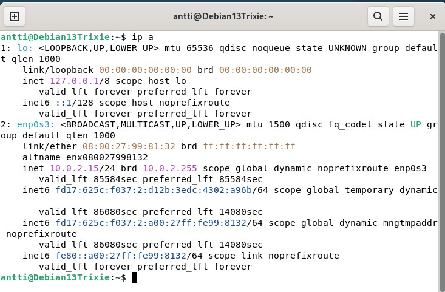
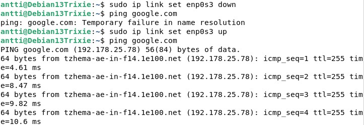
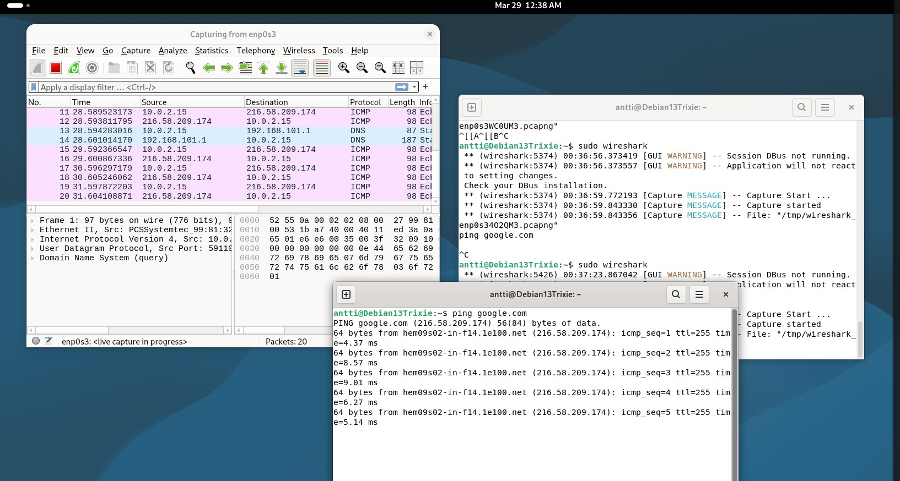
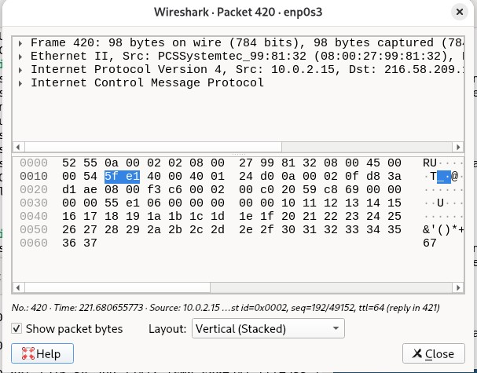

## h1 Sniff

# x) 
# Karvinen 2025: Wireshark - Getting Started
- Wireshark on johtava ohjelma datan monitorointiin ja analysointiin

# Karvinen 2025: Network Interface Names on Linux
- Network interface kertoo onko yhteys langallinen vai langaton ja missä se sijaitsee.

# b) Ei voi kalastaa.

- Verkkoliitäntä on enp0s3 

- Eli en enp0s3 down ja up.
- Ping komennolla tarkistus, että toimii
# c) Wireshark.
- Asennus: sudo apt-get install wireshark.
- 
- Avasin wiresharkin
- Valitsin enp0s3
- Pingasin googlea.

# d) Oikeesti TCP/IP. 
- Klikkasin random icmp echo requestia wiresharkissa
- 
- TCp/IP malli
- Linkkikerros: Ethernet 2
- Internet kerros: Internet protocol version 4
- Kuljetuskerros: ICMP
- Sovelluskerros: Ei ole nähtävissä.
