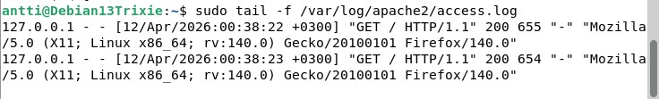

## H2 Tehtävä

x) 
- Pyramidissa ylöspäin menenminen hankaloittaa hyökkääjän tekemistä. Pyramidi pakottaa hyökkääjään muuttamaan toimintatapojaan.
- Timantti eli 4 osaa. Hyökkääjä, kohde, käytetyt kyvykkyydet ja infra. Timantti auttaa ymmärtämään hyökkäyksiä kokonaisuutena.
a) sudo apt update
  sudo apt install apache2
  - Apache ei toiminut aluksi, sillä nginx käytti samaa porttia, joten nginx piti sulkea

