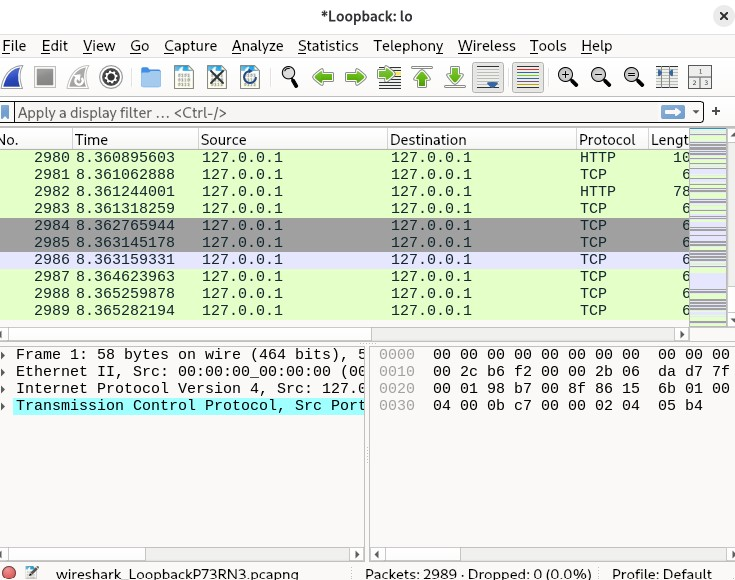
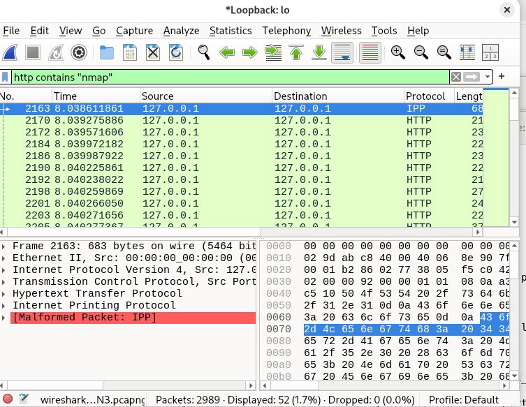

## H2 Tehtävä

# x) 
- Pyramidissa ylöspäin menenminen hankaloittaa hyökkääjän tekemistä. Pyramidi pakottaa hyökkääjään muuttamaan toimintatapojaan.
- Timantti eli 4 osaa. Hyökkääjä, kohde, käytetyt kyvykkyydet ja infra. Timantti auttaa ymmärtämään hyökkäyksiä kokonaisuutena.
# a)
- sudo apt update
- sudo apt install apache2
- Apache ei toiminut aluksi, sillä nginx käytti samaa porttia, joten nginx piti sulkea
- 

# b) 
- 
- 
- sudo nmap -A localhost
Starting Nmap 7.95 ( https://nmap.org ) at 2026-04-12 00:44 EEST
Nmap scan report for localhost (127.0.0.1)
Host is up (0.000064s latency).
Other addresses for localhost (not scanned): ::1
Not shown: 995 closed tcp ports (reset)
PORT     STATE SERVICE VERSION
80/tcp   open  http    Apache httpd 2.4.66 ((Debian))
|_http-server-header: Apache/2.4.66 (Debian)
|_http-title: Site doesn't have a title (text/html).
111/tcp  open  rpcbind 2-4 (RPC #100000)
| rpcinfo: 
|   program version    port/proto  service
|   100000  2,3,4        111/tcp   rpcbind
|   100000  2,3,4        111/udp   rpcbind
|   100000  3,4          111/tcp6  rpcbind
|   100000  3,4          111/udp6  rpcbind
|   100003  3,4         2049/tcp   nfs
|   100003  3,4         2049/tcp6  nfs
|   100005  1,2,3      34755/tcp   mountd
|   100005  1,2,3      44172/udp6  mountd
|   100005  1,2,3      52087/udp   mountd
|   100005  1,2,3      54193/tcp6  mountd
|   100021  1,3,4      37247/tcp6  nlockmgr
|   100021  1,3,4      45797/tcp   nlockmgr
|   100021  1,3,4      52794/udp   nlockmgr
|   100021  1,3,4      58964/udp6  nlockmgr
|   100024  1          43547/tcp6  status
|   100024  1          46564/udp   status
|   100024  1          48817/tcp   status
|   100024  1          49590/udp6  status
|   100227  3           2049/tcp   nfs_acl
|_  100227  3           2049/tcp6  nfs_acl
631/tcp  open  ipp     CUPS 2.4
|_http-server-header: CUPS/2.4 IPP/2.1
|_http-title: Home - CUPS 2.4.10
| http-robots.txt: 1 disallowed entry 
|_/
1234/tcp open  ssh     OpenSSH 10.0p2 Debian 7 (protocol 2.0)
2049/tcp open  nfs_acl 3 (RPC #100227)
Device type: general purpose
Running: Linux 2.6.X|5.X
OS CPE: cpe:/o:linux:linux_kernel:2.6.32 cpe:/o:linux:linux_kernel:5 cpe:/o:linux:linux_kernel:6
OS details: Linux 2.6.32, Linux 5.0 - 6.2
Network Distance: 0 hops
Service Info: OS: Linux; CPE: cpe:/o:linux:linux_kernel

OS and Service detection performed. Please report any incorrect results at https://nmap.org/submit/ .
Nmap done: 1 IP address (1 host up) scanned in 8.13 seconds

- Eli 80/tcp open http = palvelimella on auki http portti, jolla on web palvelin. Nmap tunnistaa sen apacheksi.

# c)

- HTTP portilla 80tcp oli (http-server-header) ja (http-title) skriptit.

# d)
 Komento = sudo grep -i nmap /var/log/apache2/access.log

 - Lokista löytyi "nmap scripting engine" josta tunnistaa skannauksen.
 - Skannaus tapahtui myös samasta ip osoitteesta ja yhtaikaisesti, joka on myös merkki.

# e)
- 
- 
- Wireshark sisälsi http paketteja, joissa näkyin nmap scripting engine, ja suuri määrä pyyntöjä samasta ip-osoitteesta.

# f)
Esimerkkejä kohdista, joissa on nmap
- 
HTTP user agent
- User-Agent: Mozilla/5.0 (compatible; Nmap Scripting Engine; https://nmap.org/book/nse.html)
HTTP pyyntö
- GET /nmaplowercheck1775945263 HTTP/1.1
User-Agent: Mozilla/5.0 (compatible; Nmap Scripting Engine; https://nmap.org/book/nse.html)
OPTIONS pyyntö
- OPTIONS / HTTP/1.1
User-Agent: Mozilla/5.0 (compatible; Nmap Scripting Engine; https://nmap.org/book/nse.html)
