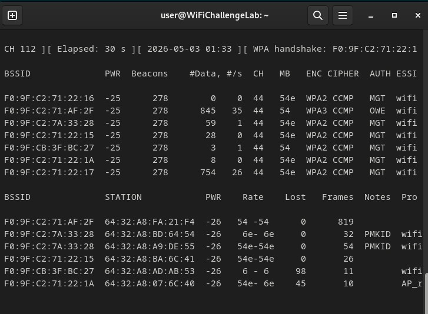
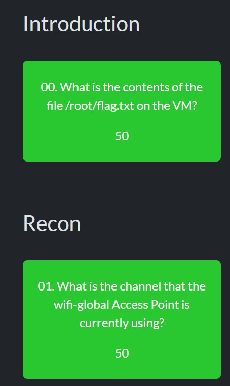

# WiFi

## a)

- 
- 
- Ehdin tehdä muutaman harjoituksen, ja ne vaikuttivat mielenkiintoisilta

## b)

- Tein vain muutaman toistaiseksi, mutta harjoitus ympäristö on hyvin toteutettu, ja tehtävät vaikuttavat sopivan haastavilta, ja mielenkiintoisilta. Opin scannamaan wifi verkkoja ja käyttämään eri työkaluja kuten airodumppia. Harjoitusten tekeminen vaati enemmän perehtymistä työkaluihin ja miten niitä käytetään. Yllätyin siitä paljon dataa on saatavilla.

## c)

En pidä wlania enää nii turvallisena, ja olen oppinut sen haavoittuvuuksista. Tiedonmäärä oli yllättävää ja ohjelmien helppous. Dataa tuli yhdellä komennolla runsaat määrät näkyville. Jatkossa mietin tietoturva riskejä enemmän.

