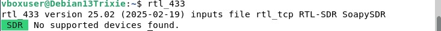
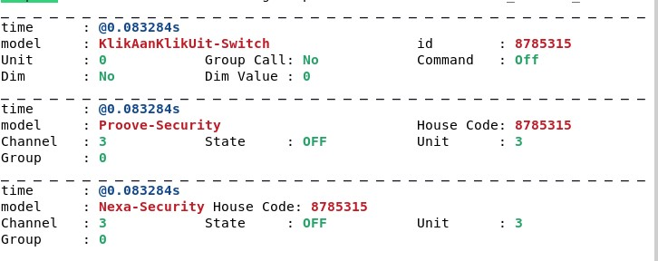

# h7 Aaltoja harjaamassa

## x) 

## Hubacek 2019: Universal Radio Hacker SDR Tutorial on 433 MHz radio plugs:
- Valitaan oikea taajuus ja tehdään signaali. Signaali näkyy heti URH:ssa. Bittien ja Hexien avulla voi tarkistaa toimivuuden.

## Cornelius 2022: Decode 433.92 MHz weather station data:
- OSti lidlistä sääaseman, joka toimii 433.92 taajuudella ja rtl radion. Dekoodasi rtl433 ohjelmalla sääaseman laitteen Nexus-TH nimiseksi. Käytti myös (URH) tallentamaan lähetystä. Sensori lähetti dataa 57 sekunnin välein. Tekstissä on ohjeet tämän toistamiseen

## a) Lähteet ja läppä. 
- tehty ☑️

## b) rtl_433.

## c) Automaattinen analyysi.

- RTL_433 tunnisti kolme eri kohdetta. KlikAanKlikUit-Switch, Proove-Security ja Nexa-Security
- ID: 8785315
- Channel: 3
- Unit: 0/3
- State: Off
- Dim: no
- Group: 0

## d) Too compex 16?

Muokkaus muotoon cs8 --> cp Recorded-HackRF-20250411_183354-433_92MHz-2MSps-2MHz.complex16s Converted_433.92M_2000k.cs8

## e) Ultimate.

## f) Yleiskuva.

## g) Bittistä.
